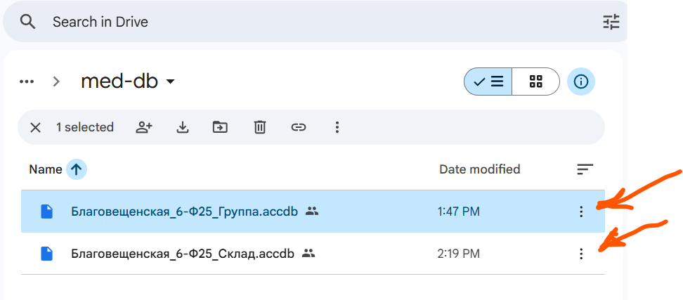
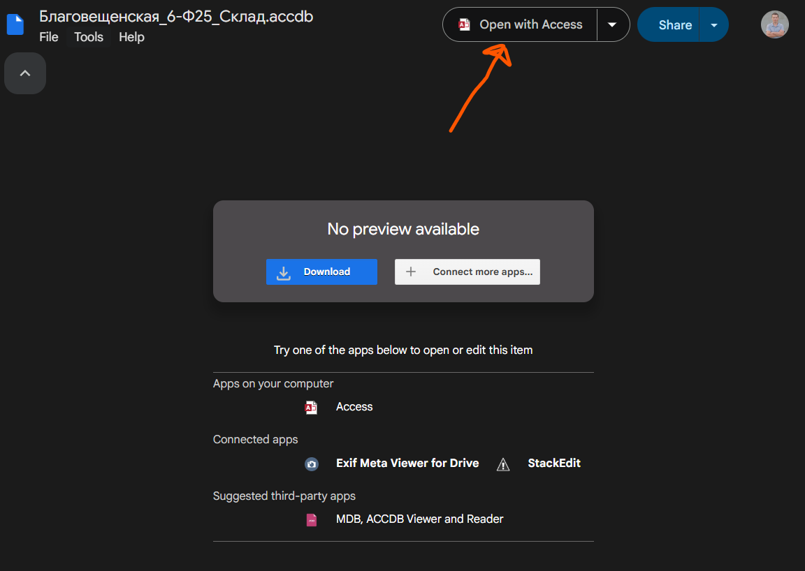
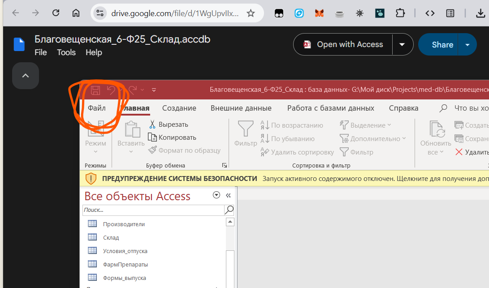
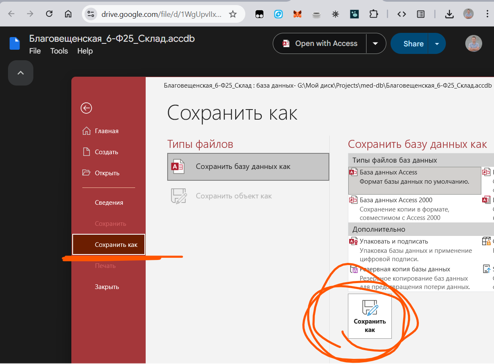

Есть два варианта сохранить файлы на компьютер - или из папки, или по прямым ссылкам

## Папка с файлами

[Открыть папку с файлами](https://drive.google.com/drive/folders/1a2U60R9sq4K9eBuWDNzPX9iLcdpis5lf?usp=sharing)

> 💡 Эта ссылка полезна, если хочешь посмотреть содержимое папки в браузере.

## Ссылки на файлы

> Чтобы **скачать файлы**, используйте прямые ссылки ниже.

[Скачать файл «Группа» (.accdb)](https://drive.google.com/file/d/1WgUpvIIxtrW3T9WoSi8iy74c_RZeYsqd/view?usp=sharing)

[Скачать файл «Склад» (.accdb)](https://drive.google.com/file/d/1iqsQSDZnznmgl5uf4UdLvRkYe6Prcrq9/view?usp=sharing)

### Как сохранить по прямой ссылке

Если появилось меню открыть с помощью... выбери access

Файл откроется в access и его надо будет сохранить через меню файл в свою папку

Нажми на сохранить как и выбери путь к своей папке

